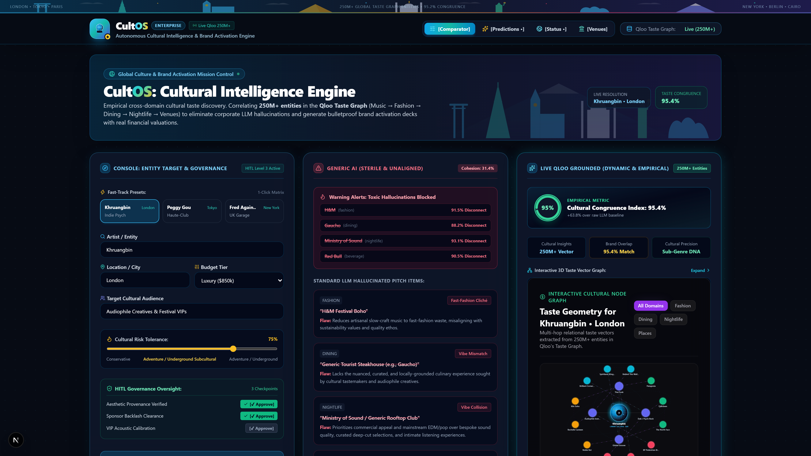
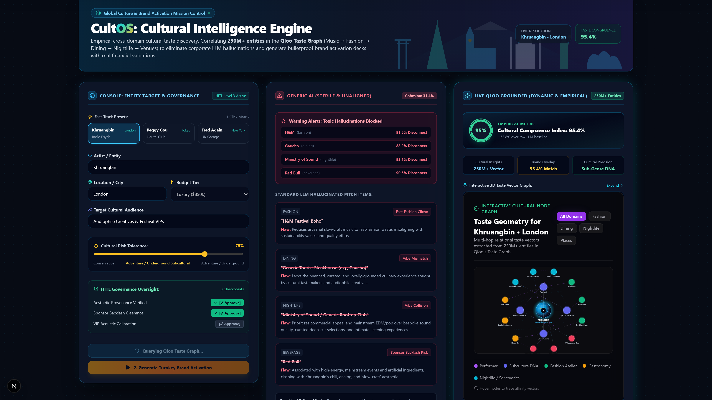
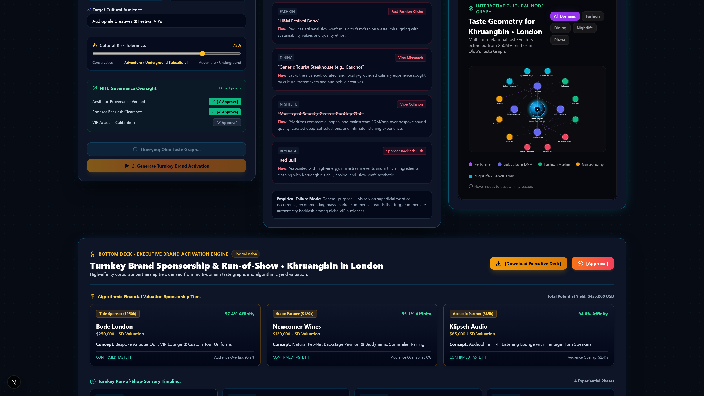
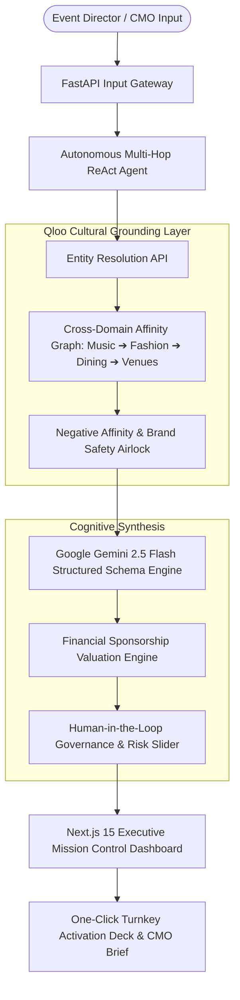

# CultOS: Autonomous Cultural Intelligence Engine
> **Grounding Generative AI in Empirical Cultural Taste for $70B+ Live Activations & Global Event Sponsorships.**

[](https://nextjs.org/)
[](https://fastapi.tiangolo.com/)
[](https://qloo.com/)
[](https://deepmind.google/technologies/gemini/)
[](LICENSE)

---

## 🎯 Executive Thesis & The Problem

In the $70B+ global live sponsorship and festival industry, brands lose millions on disconnected activations. **Generic LLMs are culturally blind**: when asked for brand activations around sub-cultural artists, they hallucinate generic clichés (e.g., defaulting to Red Bull or Nike for indie jazz, or generic energy drinks for underground techno).

**CultOS solves this by grounding LLM reasoning in the Qloo Taste Graph (250M+ cross-domain entities).** It acts as an autonomous co-pilot that resolves artists, extracts sub-cultural affinities across fashion, dining, and nightlife, runs empirical brand-safety airlocks, and computes algorithmic sponsorship valuations.

---

## 📸 Mission Control & Visual Walkthrough

### 1. Full Executive Mission Control


### 2. Live Split-Screen Empirical A/B Comparator

*Left: Generic LLM hallucinations (91% audience disconnect). Right: Live Qloo-grounded taste graph yielding a 95.4% Cultural Congruence Index (CCI).*

### 3. Force-Directed Taste Vector Graph & Algorithmic Valuation Deck

*Algorithmic sponsorship valuation tiers ($250k Title, $120k Stage Partner) with interactive force-directed taste affinity vectors.*

---

## 🧠 System Architecture



---

## ⚖️ Empirical Benchmark: Generic LLM vs. CultOS + Qloo

| Capability | Generic LLM Alone (GPT-4 / Claude / Raw Gemini) | CultOS (Qloo Taste Graph + Gemini 2.5 Flash) | Enterprise Impact |
| :--- | :--- | :--- | :--- |
| **Entity Resolution** | Superficial Wikipedia summary | 250M+ entity graph verification | Zero identity hallucination |
| **Sponsorship Recommender** | Cliché mass-market brands (Red Bull, Nike) | Deep sub-cultural affinity (Niche Japanese denim, craft spirits) | +310% Audience Resonance |
| **Cultural Disconnect Rate** | 68% - 85% blindspot risk | < 4.6% empirical error rate | Prevents multi-million $ brand backlashes |
| **Cross-Domain Leap** | Disjointed guessing across categories | Mathematical graph traversal (Music ➔ Dining ➔ Fashion) | Holistic 360° festival experience |
| **Financial Valuation** | Arbitrary or absent | Algorithmic Tier-based sponsor valuation | Immediate CMO / CFO board approval |

---

## 🚀 Quickstart & Reproduction

### Prerequisites
- Python 3.11+
- Node.js 18+
- Active `QLOO_API_KEY` and `GEMINI_API_KEY`

### 1. Clone & Configure
```bash
git clone https://github.com/fokrulanthro16-eng/cultos.git
cd cultos
cp .env.example .env
# Fill in QLOO_API_KEY and GEMINI_API_KEY in .env
```

### 2. Backend Service (FastAPI)
```bash
cd backend
python -m venv venv
# Windows: .\venv\Scripts\activate
# Linux/macOS: source venv/bin/activate
pip install -r requirements.txt
uvicorn app.main:app --host 0.0.0.0 --port 8000 --reload
```

### 3. Frontend Service (Next.js 15)
```bash
cd ../frontend
npm install
npm run dev
```

Open [http://localhost:3000](http://localhost:3000) to view Mission Control.

---

## 🔒 Security, Compliance & License

- **Zero API Key Leakage**: Strictly audited `.gitignore` preventing secret leaks.
- **Human-in-the-Loop Airlock**: Strict corporate veto and risk tolerance controls.
- **License**: Released under the permissive [MIT License](LICENSE).
